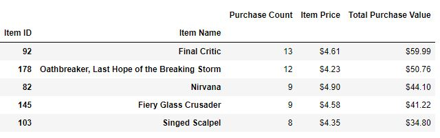

# Game purchases analysis with Pandas
Pandas project for Monash Data Analytics Boot Camp

The purpose of this project was to analyse the purchasing data for the fictitious fantasy game Heroes of Pymoli.

# Data

There is one key source of data used:

* [purchase_data.csv](HeroesOfPymoli/Resources//purchase_data.csv) - .csv dataset composed of seven columns: `Purchase ID`, `SN`, `Age`, `Gender`, `Item ID`,	`Item Name` and `Price`

# Analysis

### Player Count

* Total Number of Players

### Purchasing Analysis (Total)

* Number of Unique Items
* Average Purchase Price
* Total Number of Purchases
* Total Revenue

### Gender Demographics

* Percentage and Count of Male Players
* Percentage and Count of Female Players
* Percentage and Count of Other / Non-Disclosed

### Purchasing Analysis (Gender)

* The below each broken by gender
  * Purchase Count
  * Average Purchase Price
  * Total Purchase Value
  * Average Purchase Total per Person by Gender

### Age Demographics

* The below each broken into bins of 4 years (i.e. &lt;10, 10-14, 15-19, etc.)
  * Purchase Count
  * Average Purchase Price
  * Total Purchase Value
  * Average Purchase Total per Person by Age Group

### Top Spenders

* Identify the the top 5 spenders in the game by total purchase value, then list (in a table):
  * SN
  * Purchase Count
  * Average Purchase Price
  * Total Purchase Value

### Most Popular Items

* Identify the 5 most popular items by purchase count, then list (in a table):
  * Item ID
  * Item Name
  * Purchase Count
  * Item Price
  * Total Purchase Value

### Most Profitable Items

* Identify the 5 most profitable items by total purchase value, then list (in a table):
  * Item ID
  * Item Name
  * Purchase Count
  * Item Price
  * Total Purchase Value

## Three Observable Trends
* Majority of the players are male - 84.03% of players and they generate 82.68% of the total revenue.
* Majority of the players are young - 76.74% of playes are aged between 15 and 29.
* Users aged between 20 and 24 make the most purchases and generate 46.81% of the total revenue.

# Demo

To run the example locally run `main.ipynb` file in Jupyter Notebook.

# Used Tools
 * Jupyter Notebook 
 * Pandas

#

#### Contact: mil.haszek@gmail.com
